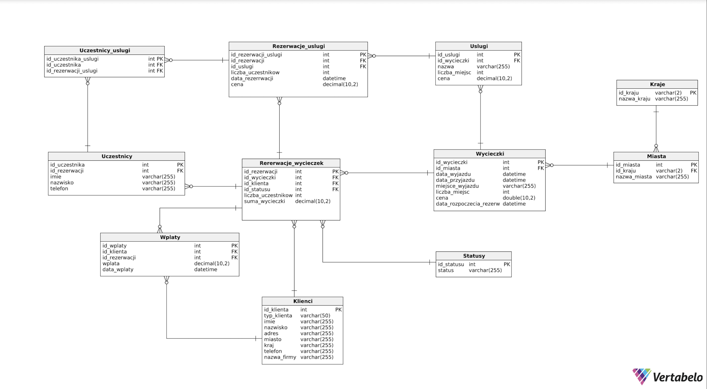
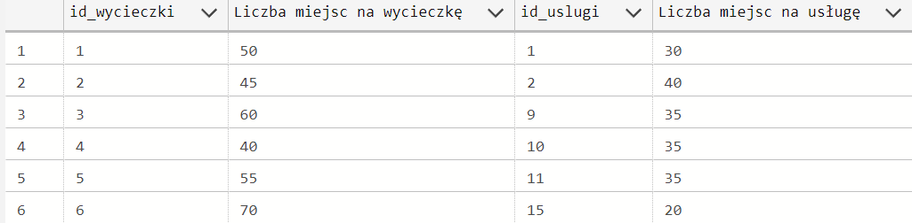
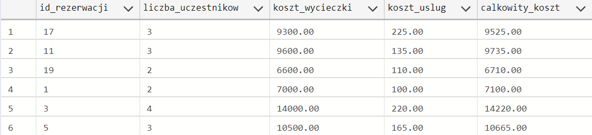
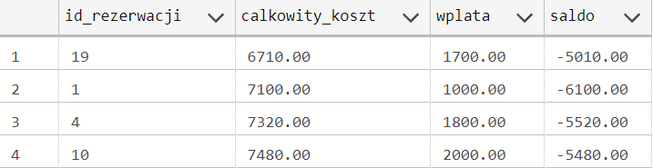
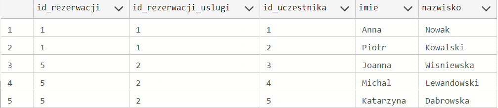

---
# Bazy danych


**Autorzy:** (Olga Kozioł, Dawid Ryba, Wojciech Cieplichiewicz, Klaudia Kiliańska)

--- 

# 1.	Wymagania i funkcje systemu

Główną funkcją systemu jest wspomaganie działalności firmy świadczącej usługi turystyczne dla klientów indywidualnych oraz firm.

Klientom powinien on udostępniać możliwość zarezerwowania wycieczki. Aby to wykonać, klient musi wprowadzić swoje dane, liczbę uczestników, ich dane oraz id wycieczki i wybrać, jakie usługi chce zarezerwować. 

Wówczas tabele zostają uzupełnione o podane wyżej dane, a dodatkowo id klienta oraz datę dokonania rezerwacji. Automatycznie wprowadzana jest również data, do której możliwe jest dokonanie zmian w zamówieniu oraz koszt całego zamówienia. Aktualizowana jest również liczba dostępnych miejsc.

Rolą administratora jest dodawanie do bazy wycieczek, możliwych dla nich usług oraz limitów miejsc. 

# 2.	Baza danych

## Schemat bazy danych



## Opis poszczególnych tabel

Nazwa tabeli: Klienci
- Opis:

| Nazwa atrybutu | Typ | Opis/Uwagi |
| -------------- | --- | ---------- |
| id_klienta   |  int   |    Klucz główny, niepowtarzalny, który się inkrementuje automatycznie        |
| typ_klienta | varchar (50) | Może przyjmować dwie wartości: I - indywidualny, F - firma |
| imie   |  varchar(255)   |     Imię klienta płacącego za wycieczkę       |
|nazwisko|varchar(255)|Nazwisko klienta płacącego za wycieczkę |
|adres|varchar(255)|Adres klienta płacącego za wycieczkę|
| miasto | varchar (255) | Adres - miasto |
| kraj | varchar (255) | Adres - kraj |
|telefon|varchar(255)|Numer telefonu klienta płacącego za wycieczkę|
|nazwa_firmy| varchar(255)| Nazwa firmy, jeśli osoba prytatna to pole zawiera napis "brak"|


- kod DDL

```sql
CREATE TABLE Klienci (
    typ_klienta varchar(50) NOT NULL CHECK (typ_klienta in ('I', 'F')),
    id_klienta int IDENTITY(1,1) PRIMARY KEY,
    imie varchar(255)  NOT NULL,
    nazwisko varchar(255)  NOT NULL,
    adres varchar(255)  NOT NULL,
    miasto varchar(255) NOT NULL,
    kraj varchar(255) NOT NULL,
    telefon varchar(255)  NOT NULL
    nazwa_firmy varchar(255)  NOT NULL
);
```

Nazwa tabeli: Kraje
- Opis:

| Nazwa atrybutu | Typ | Opis/Uwagi |
| -------------- | --- | ---------- |
| id_kraju   |  varchar(2)   |    Klucz główny, niepowtarzalny, kod kraju        |
| nazwa_kraju   |  varchar(255)   |     Nazwa kraju       |


- kod DDL

```sql
CREATE TABLE Kraje (
    id_kraju varchar(2) NOT NULL PRIMARY KEY,
    nazwa_kraju varchar(255)  NOT NULL,
);
```

Nazwa tabeli: Miasta
- Opis:

| Nazwa atrybutu | Typ | Opis/Uwagi |
| -------------- | --- | ---------- |
| id_miasta   |  int  |    Klucz główny, niepowtarzalny, który się inkrementuje       |
| id_kraju   |  varchar(2)  |    Klucz obcy, z tabeli Kraje       |
| nazwa_miasta  |  varchar(255)   |     Nazwa miasta      |


- kod DDL

```sql
CREATE TABLE Miasta (
	id_miasta int IDENTITY(1,1) PRIMARY KEY,
    id_kraju varchar(2)  NOT NULL,
    nazwa_miasta varchar(255)  NOT NULL,
    FOREIGN KEY (id_kraju) REFERENCES Kraje(id_kraju)
);
```
Nazwa tabeli: Wycieczki
- Opis:  

| Nazwa atrybutu | Typ | Opis/Uwagi                                      |
| -------------- | --- | ----------------------------------------------- |
| id_wycieczki   | int | Klucz główny, niepowtarzalny, który się inkrementuje automatycznie |
|id_miasta | int | Nazwa miasta |
|data_wyjazdu|date|Data rozpoczęcia wycieczki|
|data_przyjazdu|date|Data zakończenia wycieczki|
|miejsce_wyjazdu|varchar(255)|Miejsce wyjazdu|
|liczba_miejsc|int|Liczba dostępnych miejsc|
|cena|decimal(10,2)|Cena wycieczki zł/gr|
|data_rozpoczecia_rezerwacji | date | data, od kiedy można rezerwować wycieczkę |

- kod DDL

```sql
CREATE TABLE Wycieczki (
    id_wycieczki int IDENTITY(1,1) PRIMARY KEY,
    id_miasta int NOT NULL,
    data_wyjazdu datetime NOT NULL,
    data_przyjazdu datetime NOT NULL,
    miejsce_wyjazdu varchar(255) NOT NULL,
    liczba_miejsc int NOT NULL CHECK (liczba_miejsc > 0),
    cena decimal(10,2) NOT NULL CHECK (cena > 0),
    data_rozpoczecia_rez datetime NOT NULL,
    FOREIGN KEY (id_miasta) REFERENCES Miasta(id_miasta)
);
```

Nazwa tabeli: Statusy
- Opis:

| Nazwa atrybutu | Typ | Opis/Uwagi |
| -------------- | --- | ---------- |
| id_statusu | int | Klucz główny, niepowtarzalny, który się automatycznie inkrementuje |
| status | varchar(255) | Opis statusu |

- kod DDL

```sql
CREATE TABLE Statusy (
    id_statusu int  NOT NULL CHECK (id_statusu in (0, 1)) PRIMARY KEY,
    status varchar(255)  NOT NULL,
);
```

Nazwa tabeli: Rezerwacje_wycieczek
- Opis:

| Nazwa atrybutu | Typ | Opis/Uwagi |
| -------------- | --- | ---------- |
| id_rezerwacji   |  int  |    Klucz główny, niepowtarzalny, który się inkrementuje       |
| id_wycieczki   |  int  |    Klucz obcy, z tabeli Wycieczki      |
| id_klienta | int | Klucz obcy, z tabeli Klienci |
| id_statusu | int | Klucz obcy, z tabeli słownikowej Statusy |
| liczba_uczestnikow | int | Liczba uczestników |
| data_rezerwacji | date | Data rezerwacji |


- kod DDL

```sql
CREATE TABLE Rezerwacje_wycieczek (
    id_rezerwacji int IDENTITY(1,1) PRIMARY KEY,
    id_wycieczki int NOT NULL,
    id_statusu int NOT NULL CHECK (id_statusu in (0, 1)),
    id_klienta int NOT NULL,
    liczba_uczestnikow int NOT NULL CHECK (liczba_uczestnikow > 0),
    data_rezerwacji date NOT NULL,
	FOREIGN KEY (id_wycieczki) REFERENCES Wycieczki(id_wycieczki),
	FOREIGN KEY (id_klienta) REFERENCES Klienci(id_klienta),
	FOREIGN KEY (id_statusu) REFERENCES Statusy(id_statusu)
);

```

Nazwa tabeli: Uslugi
- Opis:

| Nazwa atrybutu | Typ | Opis/Uwagi |
| -------------- | --- | ---------- |
| id_uslugi   |  int   |    Klucz główny, niepowtarzalny, który się inkrementuje automatycznie        |
|id_wycieczki|int|Klucz obcy z tabeli Wycieczki|
| nazwa   |  varchar(255)   |     Nazwa Usługi       |
|liczba_miejsc|int|Liczba miejsc na daną usługę|
|cena|decimal(10,2)|Cena za daną usługę zł/gr|

- kod DDL

```sql
CREATE TABLE Uslugi (
	id_uslugi int IDENTITY(1,1) PRIMARY KEY,
	id_wycieczki int NOT NULL,
    nazwa varchar(255)  NOT NULL,
    liczba_miejsc int NOT NULL CHECK (liczba_miejsc > 0),
    cena decimal(10,2) NOT NULL CHECK (cena > 0),
    FOREIGN KEY (id_wycieczki) REFERENCES Wycieczki(id_wycieczki)
);
```

Nazwa tabeli: Rezerwacje_uslugi
- Opis:

| Nazwa atrybutu | Typ | Opis/Uwagi |
| -------------- | --- | ---------- |
| id_rezerwacji_uslugi   |  int  |    Klucz główny, niepowtarzalny, który się inkrementuje       |
| id_rezerwacji   |  int  |    Klucz obcy, z tabeli Rezerwacje_wycieczek      |
| id_uslugi | int | Klucz obcy, z tabeli Uslugi |
| liczba_uczestnikow | int | Liczba uczestników |
| data_rezerwacji | date | Data rezerwacji |
| cena | decimal(2,10) | Cena usługi
- kod DDL

```sql
CREATE TABLE Rezerwacje_uslugi (
    id_rezerwacji_uslugi int IDENTITY(1,1) PRIMARY KEY,
    id_rezerwacji int  NOT NULL,
    id_uslugi int  NOT NULL,
    liczba_uczestnikow int  NOT NULL CHECK (liczba_uczestnikow > 0),
    data_rezerwacji date NOT NULL,
    cena decimal(10,2) NOT NULL CHECK (cena > 0),
    FOREIGN KEY (id_rezerwacji) REFERENCES Rezerwacje_wycieczek(id_rezerwacji),
	FOREIGN KEY (id_uslugi) REFERENCES Uslugi(id_uslugi)
);
```

Nazwa tabeli: Uczestnicy
- Opis:

| Nazwa atrybutu | Typ | Opis/Uwagi |
| -------------- | --- | ---------- |
| id_uczestnika  |  int   |    Klucz główny, niepowtarzalny, który się inkrementuje automatycznie |
|id_rezerwacji|int |Klucz obcy z tabeli rezerwacje|
|imie|varchar(255)|Imie uczestnika wycieczki|
|nazwisko|varchar(255)|Nazwisko uczestnika wycieczki|
|telefon|varchar(255)|Numer telefonu uczestnika wycieczki|

```sql
CREATE TABLE Uczestnicy (
    id_uczestnika int IDENTITY(1,1) PRIMARY KEY,
    id_rezerwacji int NOT NULL,
    imie varchar(255) NOT NULL,
    nazwisko varchar(255) NOT NULL,
    telefon varchar(255) NOT NULL,
    FOREIGN KEY (id_rezerwacji) REFERENCES Rezerwacje_wycieczek(id_rezerwacji)
);
```
Nazwa tabeli: Uczestnicy_uslugi
- Opis:

| Nazwa atrybutu | Typ | Opis/Uwagi |
| -------------- | --- | ---------- |
|id_uczestnika_uslugi  |  int   |    Klucz główny, niepowtarzalny, który się inkrementuje automatycznie        |
|id_uczestnika|int |Klucz obcy z tabeli Uczestnicy|
|id_rezerwacji_uslugi | int | Klucz obcy z tabeli Rezerwacje_uslugi |

```sql
CREATE TABLE Uczestnicy_uslugi (
    id_uczestnika_uslugi int IDENTITY(1,1) PRIMARY KEY,
    id_uczestnika int  NOT NULL,
    id_rezerwacji_uslugi int  NOT NULL,
	FOREIGN KEY (id_uczestnika) REFERENCES Uczestnicy(id_uczestnika),
	FOREIGN KEY (id_rezerwacji_uslugi) REFERENCES Rezerwacje_uslugi(id_rezerwacji_uslugi)
);
```

Nazwa tabeli: Wpłaty
- Opis:  

| Nazwa atrybutu | Typ | Opis/Uwagi                                      |
| -------------- | --- | ----------------------------------------------- |
|id_wplaty | int | Klucz główny, który sie automatycznie inkrementuje | 
|id_klienta | int | Klucz obcy do tabeli Klienci |
|id_rezerwacji | int | Klucz obcy do tabeli Rezerwacje |
|wplata | decimal (10,2) | Wpłacona kwota |
| data_wplaty | date | Data wpłaty |

- kod DDL

```sql
CREATE TABLE Wplaty (
    id_wplaty int IDENTITY(1,1) PRIMARY KEY,
    id_klienta int NOT NULL,
    id_rezerwacji int NOT NULL,
    wplata decimal(10,2) NOT NULL CHECK (wplata > 0),
    data_wplaty date NOT NULL,
    FOREIGN KEY (id_klienta) REFERENCES Klienci(id_klienta),
    FOREIGN KEY (id_rezerwacji) REFERENCES Rezerwacje_wycieczek(id_rezerwacji)
);
```

# 3.  Widoki, procedury/funkcje, triggery 


## Widoki

Nazwa widoku: v_informacje_o_wycieczkach
- Opis: Wyświetla wycieczki/usługi wraz z informacjami o dostępnych miejscach

- kod DDL
```sql
CREATE VIEW v_informacje_o_wycieczkach
AS
SELECT w.id_wycieczki, w.liczba_miejsc "Liczba miejsc na wycieczkę", u.id_uslugi, u.liczba_miejsc "Liczba miejsc na usługę"
from Wycieczki w
left join Uslugi u on w.id_wycieczki=u.id_wycieczki
```

Nazwa widoku: v_rezerwacje_zamowienia
- Opis: Wyświetla rezerwacje i ich całkowity koszt

- kod DDL
```sql
CREATE VIEW v_rezerwacje_zamowienia
AS
SELECT rw.id_rezerwacji, rw.liczba_uczestnikow, w.cena * rw.liczba_uczestnikow as koszt_wycieczki, sum(ru.cena) koszt_uslug, w.cena * rw.liczba_uczestnikow + sum(ru.cena) as calkowity_koszt
from Rezerwacje_wycieczek rw
join Wycieczki w on rw.id_wycieczki=w.id_wycieczki
join Rezerwacje_uslugi ru on ru.id_rezerwacji=rw.id_rezerwacji
group by rw.id_rezerwacji, rw.liczba_uczestnikow, w.cena
```

Nazwa widoku: v_saldo_rezerwacji
- Opis: Wyświetla informacje o sumie wpłat za daną rezerwację i kwocie do zapłaty lub nadpłacie

- kod DDL
```sql
CREATE VIEW v_saldo_rezerwacji
AS
SELECT rw.id_rezerwacji, v.calkowity_koszt, sum(wplata) as wplata, sum(wplata) - v.calkowity_koszt saldo
from Rezerwacje_wycieczek rw 
join v_rezerwacje_zamowienia v on v.id_rezerwacji=rw.id_rezerwacji
join wplaty w on w.id_rezerwacji=rw.id_rezerwacji
group by rw.id_rezerwacji, v.calkowity_koszt
```

Nazwa widoku: v_wykaz_uczestnikow
- Opis: Wyświetla wykaz uczestników poszczególnych wycieczek i atrakcji

- kod DDL
```sql
CREATE VIEW v_wykaz_uczestnikow
AS
SELECT rw.id_rezerwacji, ru.id_rezerwacji_uslugi, id_uczestnika, imie, nazwisko
from Rezerwacje_wycieczek rw 
join Rezerwacje_uslugi ru on rw.id_rezerwacji=ru.id_rezerwacji
join Uczestnicy u on u.id_rezerwacji=rw.id_rezerwacji
```

## Procedury/funkcje

- Opis: Funkcja wyświetlacjąca wpłaty w danym miesiącu
- kod DDL
```sql
create function f_wplaty_w_danym_miesiacu (@month int)  
returns table  
as return (  
select *  
from wplaty  
where month(data_wplaty) = @month 
);
```
- Opis: Funkcja wyświetlacjąca wycieczki zarezerwowane w danym miesiącu
- kod DDL
```sql
create function f_rezerwacje_wycieczek_w_danym_miesiacu (@month int)  
returns table  
as return (  
select *
from Rezerwacje_wycieczek  
where month(data_rezerwacji) = @month 
);
```


- Opis: Funkcja wyświetlacjąca wycieczki, które można rezerwować w danym dniu
- kod DDL
```sql
create function f_aktywne_wycieczki (@data date)
returns table  
as return (  
select *
from wycieczki 
where data_rozpoczecia_rez <= @data
);
```

- Opis: Procedura dodająca rezerwacje. Wstawia nową rezerwację do tabeli Rezerwacje_wycieczek i zwraca ID utworzonej rezerwacji. Data rezerwacji jest domyślnie ustawiona jako obecna data.
- kod DDL
```sql
CREATE OR ALTER PROCEDURE AddReservation
    @p_id_wycieczki INT,
    @p_id_klienta INT,
    @p_liczba_uczestnikow INT,
    @p_data_rezerwacji DATE = NULL
AS
BEGIN
    DECLARE @p_id_rezerwacji INT;
    IF @p_data_rezerwacji IS NULL
    BEGIN
        SET @p_data_rezerwacji = CONVERT(DATE, GETDATE());
    END
    INSERT INTO Rezerwacje_wycieczek (id_wycieczki, id_klienta, id_statusu, liczba_uczestnikow, data_rezerwacji)
    VALUES (@p_id_wycieczki, @p_id_klienta, 1, @p_liczba_uczestnikow, @p_data_rezerwacji);    
    SET @p_id_rezerwacji = SCOPE_IDENTITY();
    SELECT @p_id_rezerwacji AS id_rezerwacji;
END;
```

- Opis: Procedura dodająca uczestnika do rezerwacji wycieczki. Sprawdza też, czy nie dodano za dużo uczestników.
- kod DDL
```sql
CREATE OR ALTER PROCEDURE AddParticipant
    @p_id_rezerwacji INT,
    @p_imie varchar(255),
    @p_nazwisko varchar(255),
    @p_telefon INT
AS
BEGIN
    DECLARE @p_id_uczestnika INT;
    IF (select count(*) from Uczestnicy where id_rezerwacji = @p_id_rezerwacji) < (select Liczba_uczestnikow from Rezerwacje_wycieczek where id_rezerwacji = @p_id_rezerwacji)
    BEGIN
        INSERT INTO Uczestnicy (id_rezerwacji, imie, nazwisko, telefon)
        VALUES (@p_id_rezerwacji, @p_imie, @p_nazwisko, @p_telefon);    
        SET @p_id_uczestnika = SCOPE_IDENTITY();
        SELECT @p_id_uczestnika AS id_uczestnika;
    END;
    ELSE
    BEGIN
        SELECT 'Nie można dodać kolejnego uczestnika do tej rezerwacji' AS Message;
    END
END;
```

- Opis: Procedura anulująca rezerwację. 
- kod DDL
```sql
CREATE OR ALTER PROCEDURE CancelReservation
    @p_id_rezerwacji INT
AS
BEGIN
    IF EXISTS (SELECT 1 FROM Rezerwacje_wycieczek WHERE id_rezerwacji = @p_id_rezerwacji)
    BEGIN
        UPDATE Rezerwacje_wycieczek
        SET id_statusu = 0
        WHERE id_rezerwacji = @p_id_rezerwacji;
        SELECT 'Reservation canceled successfully.' AS Message;
    END
    ELSE
    BEGIN
        SELECT 'Reservation not found.' AS Message;
    END
END;
```

## Triggery

- Opis: Trigger aktualizujący liczbę dostępnych miejsc na wycieczkę po dodaniu rezerwacji
- kod DDL
```sql
CREATE TRIGGER t_update_available_places
ON Rezerwacje_wycieczek
AFTER INSERT
AS
BEGIN
    UPDATE Wycieczki
    SET liczba_miejsc = liczba_miejsc - i.Liczba_uczestnikow
    FROM Wycieczki w
    JOIN INSERTED i ON w.id_wycieczki = i.id_wycieczki;
END;
```

- Opis: Trigger aktualizujący liczbę dostępnych miejsc na wycieczkę po anulowaniu rezerwacji
- kod DDL
```sql
CREATE TRIGGER t_update_available_places_2
ON Rezerwacje_wycieczek
AFTER UPDATE
AS
BEGIN
    IF UPDATE(id_statusu)
    BEGIN
        UPDATE Wycieczki
        SET liczba_miejsc = liczba_miejsc + d.Liczba_uczestnikow
        FROM Wycieczki w
        JOIN DELETED d ON w.id_wycieczki = d.id_wycieczki
        JOIN INSERTED i ON d.id_rezerwacji = i.id_rezerwacji
        WHERE i.id_statusu = 0 AND d.id_statusu <> 0;
    END
END;
```


# 4. Inne

(informacja o sposobie wygenerowania danych, uprawnienia …)
