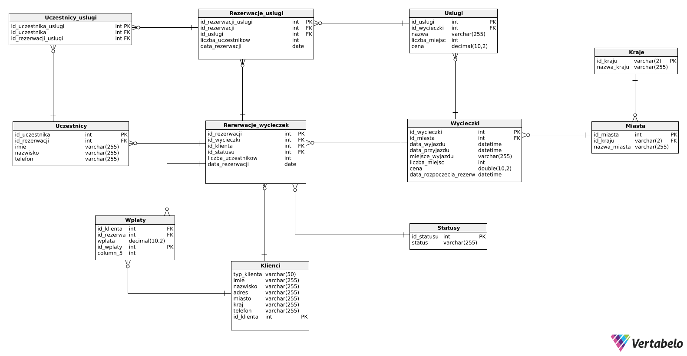

---
# Bazy danych


**Autorzy:** (Olga Kozioł, Dawid Ryba, Wojciech Cieplichiewicz, Klaudia Kiliańska)

--- 

# 1.	Wymagania i funkcje systemu

Główną funkcją systemu jest wspomaganie działalności firmy świadczącej usługi turystyczne dla klientów indywidualnych oraz firm.

Klientom powinien on udostępniać możliwość zarezerwowania wycieczki. Aby to wykonać, klient musi wprowadzić swoje dane, liczbę uczestników, ich dane oraz id wycieczki i wybrać, jakie usługi chce zarezerwować. 

Wówczas tabele zostają uzupełnione o podane wyżej dane, a dodatkowo id klienta oraz datę dokonania rezerwacji. Automatycznie wprowadzana jest również data, do której możliwe jest dokonanie zmian w zamówieniu oraz koszt całego zamówienia. Aktualizowana jest również liczba dostępnych miejsc.

Rolą administratora jest dodawanie do bazy wycieczek, możliwych dla nich usług oraz limitów miejsc. 

# 2.	Baza danych

## Schemat bazy danych



## Opis poszczególnych tabel

Nazwa tabeli: Klienci
- Opis:

| Nazwa atrybutu | Typ | Opis/Uwagi |
| -------------- | --- | ---------- |
| typ_klienta | varchar (50) | Może przyjmować dwie wartości: I - indywidualny, F - firma |
| id_klienta   |  int   |    Klucz główny, niepowtarzalny, który się inkrementuje automatycznie        |
| imie   |  varchar(255)   |     Imię klienta płacącego za wycieczkę       |
|nazwisko|varchar(255)|Nazwisko klienta płacącego za wycieczkę |
|adres|varchar(255)|Adres klienta płacącego za wycieczkę|
| miasto | varchar (255) | Adres - miasto |
| kraj | varchar (255) | Adres - kraj |
|telefon|varchar(255)|Numer telefonu klienta płacącego za wycieczkę|

- kod DDL

```sql
CREATE TABLE Klienci (
    typ_klienta varchar(50) NOT NULL CHECK (typ_klienta in ('I', 'F')),
    id_klienta int IDENTITY(1,1) PRIMARY KEY,
    imie varchar(255)  NOT NULL,
    nazwisko varchar(255)  NOT NULL,
    adres varchar(255)  NOT NULL,
    miasto varchar(255) NOT NULL,
    kraj varchar(255) NOT NULL,
    telefon varchar(255)  NOT NULL
);
```

Nazwa tabeli: Kraje
- Opis:

| Nazwa atrybutu | Typ | Opis/Uwagi |
| -------------- | --- | ---------- |
| id_kraju   |  varchar(2)   |    Klucz główny, niepowtarzalny, kod kraju        |
| nazwa_kraju   |  varchar(255)   |     Nazwa kraju       |


- kod DDL

```sql
CREATE TABLE Kraje (
    id_kraju varchar(2) NOT NULL PRIMARY KEY,
    nazwa_kraju varchar(255)  NOT NULL,
);
```

Nazwa tabeli: Miasta
- Opis:

| Nazwa atrybutu | Typ | Opis/Uwagi |
| -------------- | --- | ---------- |
| id_miasta   |  int  |    Klucz główny, niepowtarzalny, który się inkrementuje       |
| id_kraju   |  varchar(2)  |    Klucz obcy, z tabeli Kraje       |
| nazwa_miasta  |  varchar(255)   |     Nazwa miasta      |


- kod DDL

```sql
CREATE TABLE Miasta (
	id_miasta int IDENTITY(1,1) PRIMARY KEY,
    id_kraju varchar(2)  NOT NULL,
    nazwa_miasta varchar(255)  NOT NULL,
    FOREIGN KEY (id_kraju) REFERENCES Kraje(id_kraju)
);
```
Nazwa tabeli: Wycieczki
- Opis:  

| Nazwa atrybutu | Typ | Opis/Uwagi                                      |
| -------------- | --- | ----------------------------------------------- |
| id_wycieczki   | int | Klucz główny, niepowtarzalny, który się inkrementuje automatycznie |
|id_miasta | int | Nazwa miasta |
|data_wyjazdu|date|Data rozpoczęcia wycieczki|
|data_przyjazdu|date|Data zakończenia wycieczki|
|miejsce_wyjazdu|varchar(255)|Miejsce wyjazdu|
|liczba_miejsc|int|Liczba dostępnych miejsc|
|cena|decimal(10,2)|Cena wycieczki zł/gr|
|data_rozpoczecia_rezerwacji | date | data, od kiedy można rezerwować wycieczkę |

- kod DDL

```sql
CREATE TABLE Wycieczki (
    id_wycieczki int IDENTITY(1,1) PRIMARY KEY,
    id_miasta int NOT NULL,
    data_wyjazdu datetime NOT NULL,
    data_przyjazdu datetime NOT NULL,
    miejsce_wyjazdu varchar(255) NOT NULL,
    liczba_miejsc int NOT NULL CHECK (liczba_miejsc > 0),
    cena decimal(10,2) NOT NULL CHECK (cena > 0),
    FOREIGN KEY (id_miasta) REFERENCES Miasta(id_miasta)
);
```

Nazwa tabeli: Statusy
- Opis:

| Nazwa atrybutu | Typ | Opis/Uwagi |
| -------------- | --- | ---------- |
| id_statusu | int | Klucz główny, niepowtarzalny, który się automatycznie inkrementuje |
| status | varchar(255) | Opis statusu |

- kod DDL

```sql
CREATE TABLE Statusy (
    id_statusu int  NOT NULL CHECK (id_statusu in (0, 1)) PRIMARY KEY,
    status varchar(255)  NOT NULL,
);
```

Nazwa tabeli: Rezerwacje_wycieczek
- Opis:

| Nazwa atrybutu | Typ | Opis/Uwagi |
| -------------- | --- | ---------- |
| id_rezerwacji   |  int  |    Klucz główny, niepowtarzalny, który się inkrementuje       |
| id_wycieczki   |  int  |    Klucz obcy, z tabeli Wycieczki      |
| id_klienta | int | Klucz obcy, z tabeli Klienci |
| id_statusu | int | Klucz obcy, z tabeli słownikowej Statusy |
| liczba_uczestnikow | int | Liczba uczestników |
| data_rezerwacji | date | Data rezerwacji |


- kod DDL

```sql
CREATE TABLE Rezerwacje_wycieczek (
    id_rezerwacji int IDENTITY(1,1) PRIMARY KEY,
    id_wycieczki int NOT NULL,
    id_statusu int NOT NULL CHECK (id_statusu in (0, 1)),
    id_klienta int NOT NULL,
    liczba_uczestnikow int NOT NULL CHECK (liczba_uczestnikow > 0),
    data_rezerwacji date NOT NULL,
	FOREIGN KEY (id_wycieczki) REFERENCES Wycieczki(id_wycieczki),
	FOREIGN KEY (id_klienta) REFERENCES Klienci(id_klienta),
	FOREIGN KEY (id_statusu) REFERENCES Statusy(id_statusu)
);

```

Nazwa tabeli: Uslugi
- Opis:

| Nazwa atrybutu | Typ | Opis/Uwagi |
| -------------- | --- | ---------- |
| id_uslugi   |  int   |    Klucz główny, niepowtarzalny, który się inkrementuje automatycznie        |
|id_wycieczki|int|Klucz obcy z tabeli Wycieczki|
| nazwa   |  varchar(255)   |     Nazwa Usługi       |
|liczba_miejsc|int|Liczba miejsc na daną usługę|
|cena|decimal(10,2)|Cena za daną usługę zł/gr|

- kod DDL

```sql
CREATE TABLE Uslugi (
	id_uslugi int IDENTITY(1,1) PRIMARY KEY,
	id_wycieczki int NOT NULL,
    nazwa varchar(255)  NOT NULL,
    liczba_miejsc int NOT NULL CHECK (liczba_miejsc > 0),
    cena decimal(10,2) NOT NULL CHECK (cena > 0),
    FOREIGN KEY (id_wycieczki) REFERENCES Wycieczki(id_wycieczki)
);
```

Nazwa tabeli: Rezerwacje_uslugi
- Opis:

| Nazwa atrybutu | Typ | Opis/Uwagi |
| -------------- | --- | ---------- |
| id_rezerwacji_uslugi   |  int  |    Klucz główny, niepowtarzalny, który się inkrementuje       |
| id_rezerwacji   |  int  |    Klucz obcy, z tabeli Rezerwacje_wycieczek      |
| id_uslugi | int | Klucz obcy, z tabeli Uslugi |
| liczba_uczestnikow | int | Liczba uczestników |
- kod DDL

```sql
CREATE TABLE Rezerwacje_uslugi (
    id_rezerwacji_uslugi int IDENTITY(1,1) PRIMARY KEY,
    id_rezerwacji int  NOT NULL,
    id_uslugi int  NOT NULL,
    liczba_uczestnikow int  NOT NULL CHECK (liczba_uczestnikow > 0),
    FOREIGN KEY (id_rezerwacji) REFERENCES Rezerwacje_wycieczek(id_rezerwacji),
	FOREIGN KEY (id_uslugi) REFERENCES Uslugi(id_uslugi)
);
```

Nazwa tabeli: Uczestnicy
- Opis:

| Nazwa atrybutu | Typ | Opis/Uwagi |
| -------------- | --- | ---------- |
| id_uczestnika  |  int   |    Klucz główny, niepowtarzalny, który się inkrementuje automatycznie |
|id_rezerwacji|int |Klucz obcy z tabeli rezerwacje|
|imie|varchar(255)|Imie uczestnika wycieczki|
|nazwisko|varchar(255)|Nazwisko uczestnika wycieczki|
|telefon|varchar(255)|Numer telefonu uczestnika wycieczki|

```sql
CREATE TABLE Uczestnicy (
    id_uczestnika int IDENTITY(1,1) PRIMARY KEY,
    id_rezerwacji int NOT NULL,
    imie varchar(255) NOT NULL,
    nazwisko varchar(255) NOT NULL,
    telefon varchar(255) NOT NULL,
    FOREIGN KEY (id_rezerwacji) REFERENCES Rezerwacje_wycieczek(id_rezerwacji)
);
```
Nazwa tabeli: Uczestnicy_uslugi
- Opis:

| Nazwa atrybutu | Typ | Opis/Uwagi |
| -------------- | --- | ---------- |
|id_uczestnika_uslugi  |  int   |    Klucz główny, niepowtarzalny, który się inkrementuje automatycznie        |
|id_uczestnika|int |Klucz obcy z tabeli Uczestnicy|
|id_rezerwacji_uslugi | int | Klucz obcy z tabeli Rezerwacje_uslugi |

```sql
CREATE TABLE Uczestnicy_uslugi (
    id_uczestnika_uslugi int IDENTITY(1,1) PRIMARY KEY,
    id_uczestnika int  NOT NULL,
    id_rezerwacji_uslugi int  NOT NULL,
	FOREIGN KEY (id_uczestnika) REFERENCES Uczestnicy(id_uczestnika),
	FOREIGN KEY (id_rezerwacji_uslugi) REFERENCES Rezerwacje_uslugi(id_rezerwacji_uslugi)
);
```

Nazwa tabeli: Wpłaty
- Opis:  

| Nazwa atrybutu | Typ | Opis/Uwagi                                      |
| -------------- | --- | ----------------------------------------------- |
|id_klienta | int | Klucz obcy do tabeli Klienci |
|id_rezerwacji | int | Klucz obcy do tabeli Rezerwacje |
|wplata | decimal (10,2) | Wpłacona kwota |
|id_wplaty | int | Klucz główny, który sie automatycznie inkrementuje | 

- kod DDL

```sql
CREATE TABLE Wplaty (
    id_wplaty int IDENTITY(1,1) PRIMARY KEY,
    id_klienta int NOT NULL,
    id_rezerwacji int NOT NULL,
    wplata decimal(10,2) NOT NULL CHECK (wplata > 0),
    FOREIGN KEY (id_klienta) REFERENCES Klienci(id_klienta),
    FOREIGN KEY (id_rezerwacji) REFERENCES Rezerwacje_wycieczek(id_rezerwacji)
);
```

# 3.  Widoki, procedury/funkcje, triggery 


## Widoki

Nazwa widoku: Lista_uczestnikow_rezerwacji
- Opis: Lista uczestników rezerwacji
- kod DDL
```sql
CREATE VIEW Lista_uczestnikow_rezerwacji
AS
SELECT Rezerwacje_uslugi.id_rezerwacji, Uczestnicy.imie, Uczestnicy.nazwisko
FROM Rezerwacje_uslugi
JOIN Uczestnicy ON Rezerwacje_uslugi.id_rezerwacji = Uczestnicy.id_rezerwacji;

```

Nazwa widoku: Liczba_uczestnikow_wycieczki
- Opis: Liczba uczestnikow wycieczki
- kod DDL
```sql
CREATE VIEW Liczba_uczestnikow_wycieczki
AS
SELECT Rezerwacje_uslugi.id_rezerwacji, Uslugi.nazwa, COUNT(Uczestnicy.id_uczestnika) as LiczbaUczestnikow
FROM Rezerwacje_uslugi
JOIN Uczestnicy ON Rezerwacje_uslugi.id_rezerwacji = Uczestnicy.id_rezerwacji
JOIN Uslugi ON Rezerwacje_uslugi.id_uslugi = Uslugi.id_uslugi
GROUP BY Rezerwacje_uslugi.id_rezerwacji, Uslugi.nazwa;

```
Nazwa widoku: Wycieczka_i_lokalizacja
- Opis: Lokalizacja wycieczek
- kod DDL
```sql
CREATE VIEW Wycieczka_i_lokalizacja
AS
SELECT Wycieczki.id_wycieczki, Wycieczki.data_wyjazdu, Miasta.nazwa_miasta, Kraje.nazwa_kraju
FROM Wycieczki
JOIN Miasta ON Wycieczki.id_miasta = Miasta.id_miasta
JOIN Kraje ON Miasta.id_kraju = Kraje.id_kraju;
```
Nazwa widoku: Info_klient
- Opis: Podstawowe informacje o kliencie
- kod DDL
```sql
CREATE VIEW Info_klient
AS
SELECT
    id_klienta,
    CASE 
        WHEN typ_klienta = 'F' THEN nazwa_firmy
        ELSE CONCAT(imie, ' ', nazwisko)
    END AS nazwa,
    adres,
    miasto,
    kraj,
    telefon
FROM Klienci;
```

Nazwa widoku: Suma_wplaty
- Opis: Suma wplaty
- kod DDL
```sql
CREATE VIEW Suma_wplaty
SELECT 
    w.id_klienta, 
    CASE 
        WHEN k.typ_klienta = 'F' THEN k.nazwa_firmy
        ELSE CONCAT(k.imie, ' ', k.nazwisko)
    END AS nazwa,
    sum(w.wplata) AS Suma_Wplaty
FROM 
    Wplaty w
JOIN 
    Klienci k ON w.id_klienta = k.id_klienta
GROUP BY 
    w.id_klienta, k.typ_klienta, k.nazwa_firmy, k.imie, k.nazwisko;
```

Nazwa widoku: Dostepne_uslugi_i_cena
- Opis: Dostępne usługi i ich cena
- kod DDL
```sql
CREATE VIEW Dostepne_uslugi_i_cena
AS
SELECT Uslugi.nazwa, Uslugi.cena, Uslugi.liczba_miejsc
FROM Uslugi
WHERE Uslugi.liczba_miejsc > 0;

```

## Procedury/funkcje

- Opis: Procedura wyświetlająca listę uczestników danej rezerwacji
- kod DDL
```sql
create or alter proc lista_uczestnikow_danej_rezerwacji  
@id_rezerwacji int  
as  
begin  
if not exists (select * from Rezerwacje_wycieczek where id_rezerwacji = @id_rezerwacji)  
throw 50001, 'Brak rezerwacji o takim id', 1;  
end;
select *  
from Lista_uczestnikow_rezerwacji 
where id_rezerwacji = @id_rezerwacji; 
```

- Opis: Procedura wyświetlająca listę wszystkich wplat danego klienta
- kod DDL
```sql
create or alter proc wplaty_danego_klienta
@id_klienta int  
as  
begin  
if not exists (select * from Klienci where id_klienta = @id_klienta)  
throw 50001, 'Brak klienta o takim id', 1;  
end;
SELECT Klienci.id_klienta, Klienci.imie, Klienci.nazwisko, wplaty.wplata
FROM Klienci
JOIN Wplaty ON Klienci.id_klienta = Wplaty.id_klienta
where id_klienta = @id_klienta; 
```

- Opis: Procedura wyświetlająca liczbę uczestników danej usługi
- kod DDL
```sql
create or alter proc liczba_uczestnikow_danej_uslugi
@id_uslugi int  
as  
begin  
    if not exists (select * from uslugi where id_uslugi = @id_uslugi)  
        throw 50001, 'Brak wycieczki o takim id', 1;  
    SELECT id_uslugi, sum(liczba_uczestnikow)
    FROM Rezerwacje_uslugi
    where id_uslugi = @id_uslugi
    group by id_uslugi
end;
```

- Opis: Procedura wyświetlająca informacje o danym kliencie
- kod DDL
```sql
create or alter proc informacje_o_danym_kliencie
@id_klienta int  
as  
begin  
    if not exists (select * from klienci where id_klienta = @id_klienta)  
        throw 50001, 'Brak klienta o takim id', 1;  
    SELECT *
    FROM Info_klient
    where id_klienta = @id_klienta
end;
```

- Opis: Funkcja wyświetlacjąca wpłaty w danym miesiącu
- kod DDL
```sql
create function f_wplaty_w_danym_miesiacu (@month int)  
returns table  
as return (  
select *  
from wplaty  
where month(data_wplaty) = @month 
);
```
- Opis: Funkcja wyświetlacjąca wycieczki zarezerwowane w danym miesiącu
- kod DDL
```sql
create function f_rezerwacje_wycieczek_w_danym_miesiacu (@month int)  
returns table  
as return (  
select *
from Rezerwacje_wycieczek  
where month(data_rezerwacji) = @month 
);
```


- Opis: Funkcja wyświetlacjąca wycieczki, które można rezerwować w danym dniu
- kod DDL
```sql
create function f_aktywne_wycieczki (@data date)
returns table  
as return (  
select *
from wycieczki 
where data_rozpoczecia_rez <= @data
);
```


## Triggery

(dla każdego triggera należy wkleić kod polecenia definiującego trigger wraz z komentarzem)


# 4. Inne

(informacja o sposobie wygenerowania danych, uprawnienia …)
